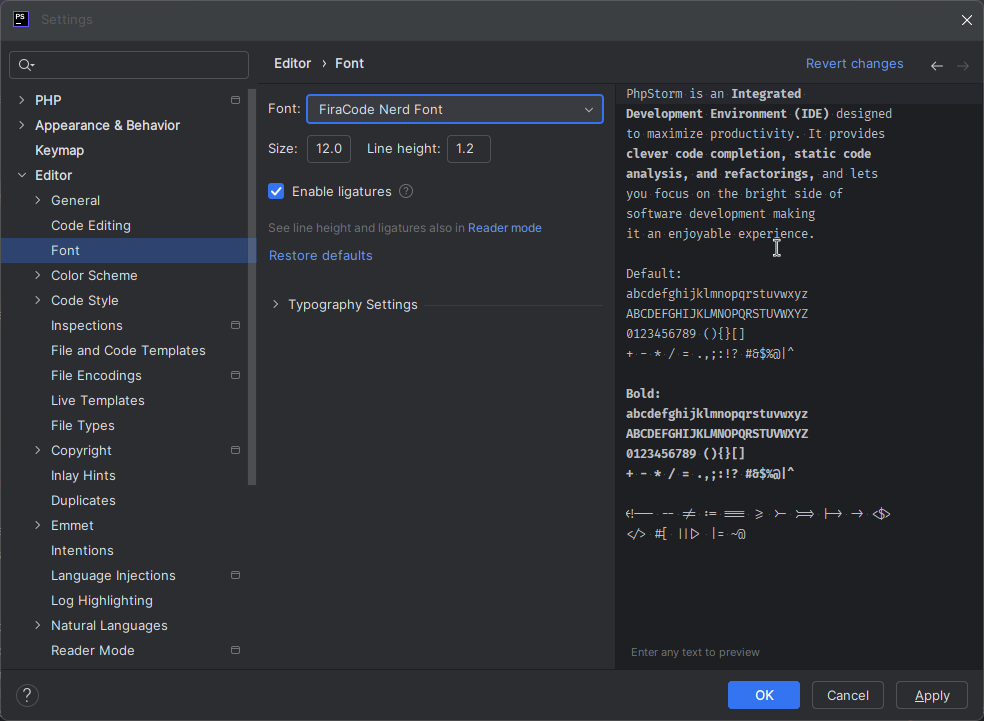

# Modificar tipografías

No olvidar activar las ligaduras.

# Breadcrumbs

![[02.png]]

# Status Bar

![[03.png]]

# Atajos

| `Alt`+ `1`                          | Mostrar/Ocultar barra lateral                   |
| ----------------------------------- | ----------------------------------------------- |
| `Ctrl` + `Alt` + `S`                | Settings                                        |
| Doble `Shift`                       | Search Everywhere                               |
| `Crtl` + `F4`                       | Cerrar la pestaña actual                        |
| `Ctrl` + click                      | Ir al archivo donde se define                   |
| `Ctrl` + `Alt` + `flecha izquierda` | Punto de edición atrás                          |
| `Ctrl` + `Alt` + `flecha derecha`   | Punto de edición adelante                       |
| `Ctrl`+`Alt`+`F7`                   | Buscar en proyecto y bibliotecas donde es usado |
| `Ctrl` + `E`                        | Ver archivos recientes                          |
| `Ctrl` +`Shift` + `E`               | Ver archivos recientes de manera más visual     |
| `Ctrl`+`Alt`+`Inicio`               | Barra de navegación flotante                    |
| `Alt` + `F12`                       | Terminal                                        |
| `Ctrl`+`Alt`+`L`                    | Reformatear código                              |
| `Ctrl`+`Alt`+`Mayus`+`L`            | Reformatear archivo                             |
| `Crtl`+`Mayus`+`Alt`+`T`            | Refactor                                        |
| `Ctrl` + `O`                        | Estructura de archivo                           |
| `Ctrl` +`Ctrl` + flecha             | Cursores múltiples                              |

# Custumize Main Toolbar

En la parte de Left sólo dejar lo relacionado con *Perforce*.
En la parte de Right sólo dejar lo relacionado con *Run*.

![[04.png]]

# Tab Placement 

![[05.png]]

# Tool Window Bars

![[06.png]]

# Line Numbers

![[07.png]]

# Laravel Idea Plugin

Instalarlo, activar trial, y generar el codigo cuando lo pida

